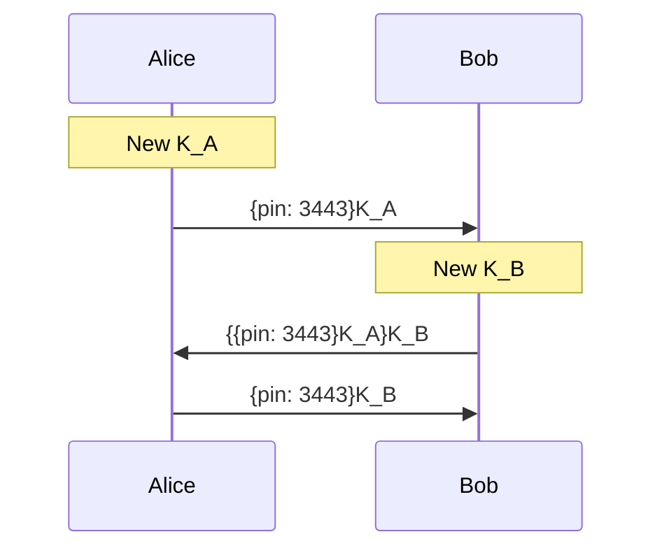
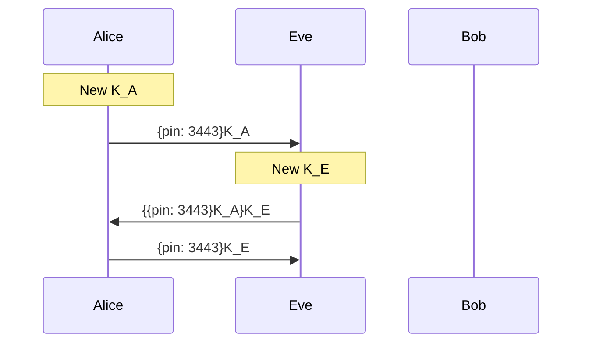
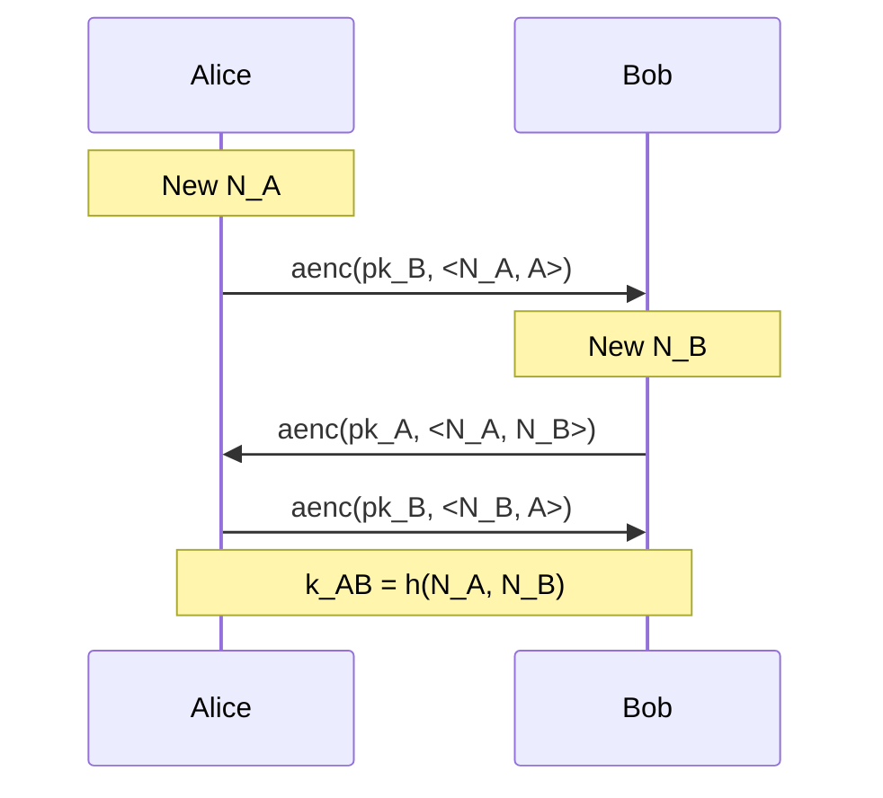
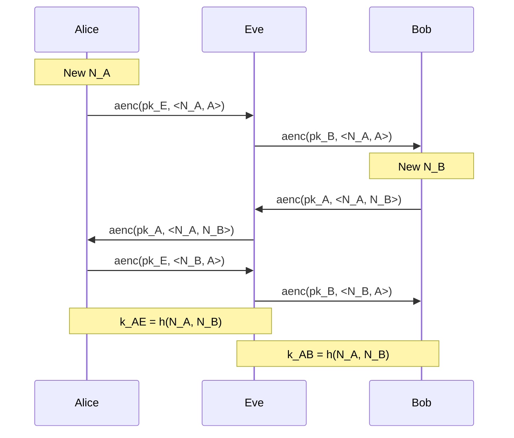
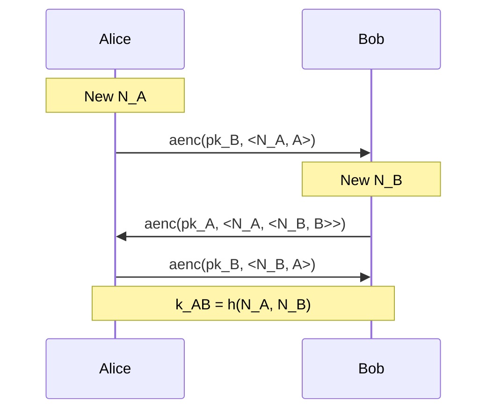
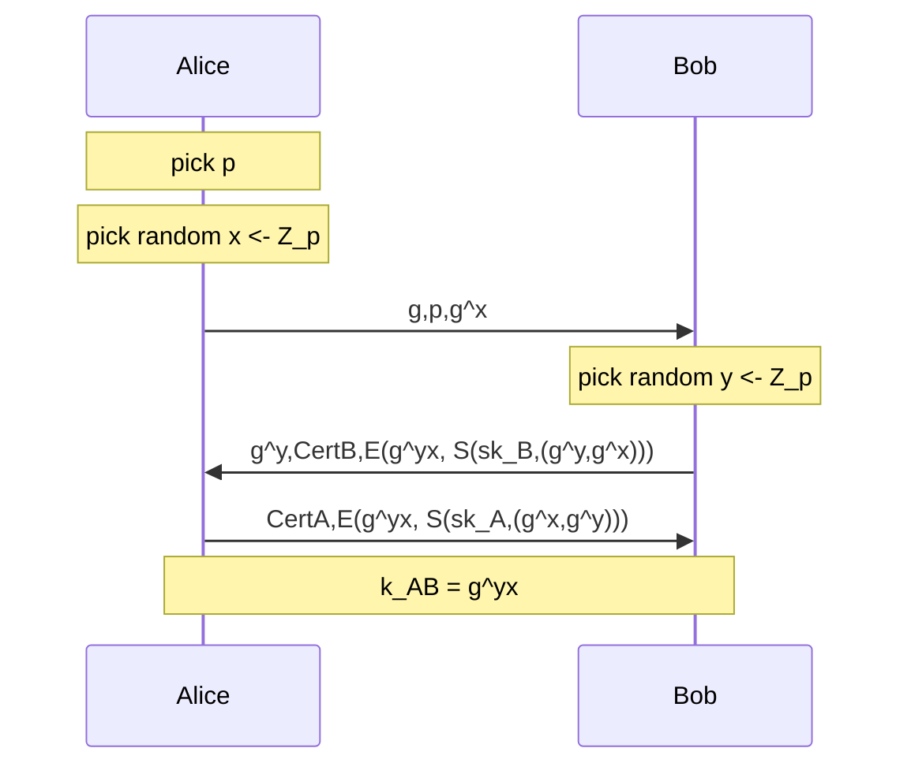

There are a multitude of attacks on communication over a public network. A malicious agent may be able to do any of the following: record, alter, delete, insert, redirect, reorder, and reuse past or current messages, and inject new messages. The agent may also have control over dishonest participants on the network. All of this can happen without anyone else on the network being aware.

Even with [[W3N2 - Symmetric encryption|symmetric]] or [[W4N2 - Public key encryption|asymmetric]] encryption along with [[W3N5 - Message Authentication Codes (MACs)|MACs]] and [[W4N3 - Digital signatures|digital signatures]], communication over the internet is still not secure. The messages are authenticated to have been created by the sender, and not to have been modified in transit, however a man in the middle could e.g. intercept that message and replay it several times, or prevent it getting through to specific websites or people.

# Desired properties of communication
At least some of these will be desired (and not all are possible at the same time), depending on the specific communication.
- **Confidentiality:** some information should never be revealed to unauthorised entities
- **Integrity:** data should not be altered in an unauthorised manner after it has been created, transmitted, or stored by an authorised source
- **Authenticity:** the identity of the communicating entity should be known with certainty
- **Anonymity:** the identity of the author of an action should not be revealed
- **Unlinkability:** an attack should not be able to deduce whether different services are delivered to the same user
- **Non-repudiation:** the author of an action should not be able to deny having triggered that action

>[!warning] Be aware
>Many exploitable errors are not due to design errors with the cryptographic primitives behind a protocol, but rather with how they are used, e.g. bad protocol design and/or buggy implementations

# Logical attacks
A **logical attack** is an attack on a cryptographic protocol which does not break the underlying cryptographic primitives. 

E.g.

Given a commutative symmetric encryption scheme (e.g. a [[W3N3 - Symmetric encryption systems#Stream ciphers|stream cipher]]) where
$$
\{\{m\}_{k_1}\}_{k_2} = \{\{m\}_{k_2}\}_{k_1}
$$
and using the following protocol:

This is insecure, as Bob's identity is not validated an intruder can reply with their own key and be able to decrypt the message

# Authentication and key agreement protocols
Generally, long term keys should be used as little as possible, using them only to establish short term session keys. Session keys are generally symmetric, as symmetric encryption tends to be less computationally expensive than asymmetric encryption.

## Needham-Schroeder Public Key (NSPK)
(N_x is a nonce, a large random number that is used only once, generated by x)

Here, each party have authenticated each other, and have established a mutual key for following symmetrically encrypted communication.

### Security requirements
- **Authenticity:** if Alice has completed the protocol, apparently with Bob, then Bob must also have completed the protocol with Alice, and vice versa
- **Confidentiality:** messages encrypted with the agreed key $k\leftarrow h(N_A,N_B)$ must remain secret

## Lowe's attack on NSPK
Here, Eve is an dishonest (but this is not known by the network) participant who Alice and Bob are willing to talk to.

Now, Eve can read all messages Bob tries to send to Alice.

### The fix - Needham-Schroeder-Low (NSL) protocol

Bob's response includes his identity, which means Eve could no longer relay it back to Alice during the MitM attack.

## Forward secrecy

>[!Info] Forward secrecy
>A protocol ensures forward secrecy, if even if long-term keys are compromised, past sessions of the protocol are still kept confidential, and this is still true if an attacker actively interfered in the past sessions.

The NSL protocol does not provide forward secrecy.

## The Station-to-Station (StS) protocol
This is similar to the [[W4N2 - Public key encryption#Diffie-Hellman (DH) protocol|DH protocol]]

where $p$ is a large prime and $g$ is a generator of $Z^*_p$.
